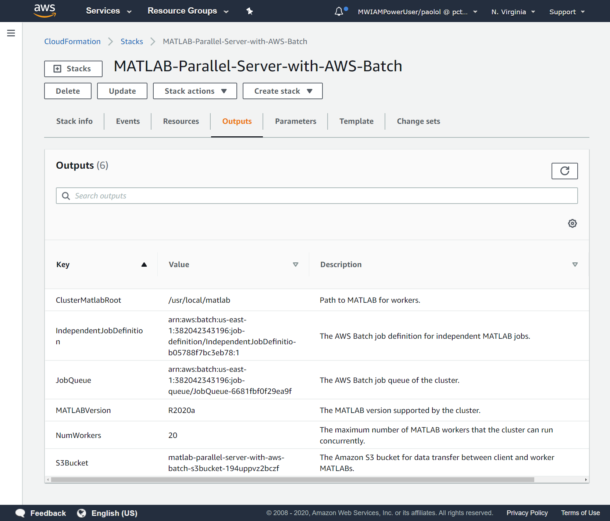

# MATLAB Parallel Server  with AWS Batch

## Step 1. Launch the Template

Click the **Launch Stack** button for your desired region below to deploy the cloud resources on AWS. This will open the AWS console in your web browser.

| Region | Launch Link |
| --------------- | ----------- |
| **us-east-1** | [](https://us-east-1.console.aws.amazon.com/cloudformation/home?region=us-east-1#/stacks/create/review?templateURL=https://matlab-parallel-server-with-aws-batch.s3.amazonaws.com/R2019b/matlab-parallel-server-with-aws-batch.json) |
| **eu-west-1** | [](https://eu-west-1.console.aws.amazon.com/cloudformation/home?region=eu-west-1#/stacks/create/review?templateURL=https://matlab-parallel-server-with-aws-batch.s3.amazonaws.com/R2019b/matlab-parallel-server-with-aws-batch.json) |


## Step 2. Configure the Cloud Resources
After you click the Launch Stack button above, the "Quick create stack" page opens in your browser where you can configure the parameters. It is easier to complete the steps if you position these instructions and the AWS CloudFormation console window side by side.

1. Specify a stack name. This will be shown in the AWS CloudFormation console and must be unique within the AWS account.

2. Specify and check the defaults for these resource parameters:

| Parameter label | Description |
| --------------- | ----------- |
| **Container image** | Specify the Docker image to use to execute jobs. This parameter is prepopulated with the default MathWorks Docker image for MATLAB Parallel Server with AWS Batch. Alternatively, specify a container repository in the form repository-url/image:tag. |
| **EC2 pricing model** | Choose either On-Demand or Spot Pricing for the EC2 instances provisioned by AWS Batch. For more information on pricing, see https://aws.amazon.com/ec2/pricing. |
| **Instance types** | Specify the Amazon EC2 instance types allowed as a comma-separated list. You can specify instance families (for example, 'c4' or 'p3') or specific sizes within a family (for example, 'c4.8xlarge'). Use 'optimal' to pick instance types on the fly that match the demands of your job queue. For more information on instance types, see https://aws.amazon.com/ec2/instance-types/. |
| **Maximum number of MATLAB workers** | Specify the maximum number of MATLAB workers that the cluster can run concurrently. This number must be less than or equal to the number of workers that your MATLAB Parallel Server license supports. |
| **Memory per MATLAB worker** | Specify the amount of memory in MiB that each MATLAB worker can use. A minimum of 2000 MiB is required. |
| **Number of GPUs per MATLAB worker** | Specify the number of GPUs for each MATLAB worker to use. If you specify a value greater than 0, you must specify at least one GPU-based instance type supported by AWS Batch in the Instance Types field. For a list of supported GPU-based instance types, see https://docs.aws.amazon.com/batch/latest/userguide/gpu-jobs.html. |
| **Number of vCPUs per MATLAB worker** | Specify the number of vCPUs for each MATLAB worker to use. Two vCPUs per worker is recommended. |
| **Spot bid price** | Specify the maximum percentage of On-Demand pricing you want to pay for Spot resources. This parameter is ignored if you select the 'On Demand' EC2 pricing model. |
| **Subnets** | Select IDs of existing subnets for the EC2 instances provisioned by AWS Batch. All subnets must exist in the VPC you have selected. It is recommended that you select a subnet for each availability zone in the VPC you have selected. |
| **VPC** | Select the ID of an existing VPC in which to deploy this stack. |


*Table 1: Stack input parameters*

3. Tick the box to accept that the template uses IAM roles. These roles provide the following permissions:
 * Allow AWS Batch to make calls to other AWS services in order to run jobs.
 * Allow containers launched by AWS Batch to access Amazon S3 and Amazon Elastic Container Service.
 * Allow a custom lambda function to run that calculates the maximum number of vCPUs for the compute environment.
 * Allow a custom lambda function to run that empties the S3 bucket when the stack is deleted.

4. Click the **Create stack** button.

 When you click Create stack, the cluster is created using AWS CloudFormation templates.  It can take up to five minutes to create the cluster.

5. When the stack status has reached **CREATE_COMPLETE**, select **Outputs**. Figure 1 shows an example of the *Outputs* view.

Identify the values of the outputs with keys 'IndependentJobDefinition', 'JobQueue', 'NumWorkers', and 'S3Bucket' for use in Step 3. If you are an administrator, pass this information to your end users.

   

*Figure 1: Stack outputs on completion*

## Step 3: Connect to the Cluster from MATLAB

If you are an administrator and do not plan to submit jobs to the cluster, you can skip the following steps.

1. Install the [AWS Command Line Interface](https://aws.amazon.com/cli) tool on the client machine.

2. Configure your client machine with your AWS credentials using the AWS Command Line Interface tool. Alternatively, you can set up your credentials by setting the environment variables listed in Table 2 on the client machine.  If you do not know your AWS credentials, contact your administrator.

    | **Environment variable** | **Description** |
    | -------------------------| ----------------|
    | AWS_ACCESS_KEY_ID        | Specifies an AWS access key associated with an IAM user or role.|
    | AWS_SECRET_ACCESS_KEY    | Specifies the secret key associated with the access key. This is essentially the "password" for the access key.|
    | AWS_SESSION_TOKEN        | Specifies the session token value. Required if you are using temporary security credentials.|
    | AWS_DEFAULT_REGION       | Specifies the AWS Region to send the request to.  The value of this environment variable is typically determined automatically but you may wish to set it manually.|

    *Table 2: Environment variables for specifying AWS credentials*

    You can set the environment variables in your current MATLAB session using `setenv` as follows:
    ```matlab
    setenv('AWS_ACCESS_KEY_ID', 'YOUR_AWS_ACCESS_KEY_ID');
    setenv('AWS_SECRET_ACCESS_KEY', 'YOUR_AWS_SECRET_ACCESS_KEY');
    setenv('AWS_SESSION_TOKEN', 'YOUR_AWS_SESSION_TOKEN');
    setenv('AWS_DEFAULT_REGION', 'YOUR_AWS_DEFAULT_REGION');
    ```

3. Download or clone the [Parallel Computing Toolbox plugin for MATLAB Parallel Server with AWS Batch](https://github.com/mathworks/matlab-parallel-awsbatch-plugin.git) repository on GitHub. You can also download this plugin via the Add-On Manager in MATLAB.

4. Once you download the plugin files, create a cluster profile by using either the Cluster Profile Manager or the MATLAB command line. To open the Cluster Profile Manager in MATLAB, on the **Home** tab, in the **Environment** section, select **Parallel** > **Create and Manage Clusters**. Within the Cluster Profile Manager, select **Add Cluster Profile** > **Generic** from the menu to create a new Generic cluster profile.

    Alternatively, for the command line workflow, create a new Generic cluster object by running:

    ```matlab
    c = parallel.cluster.Generic;
    ```

5. To configure the newly created `Generic` profile, set the properties given in the table below:

    | **Property**          | **Value**                                      |  
    | ----------------------|------------------------------------------------|
    | JobStorageLocation    | Path where job data is to be stored on your machine|
    | NumWorkers            | Number of workers used to configure the stack in [Step 2](#step-2-configure-the-cloud-resources)|
    | ClusterMatlabRoot     | '/usr/local/matlab'                            |
    | OperatingSystem       | 'unix'                                         |
    | HasSharedFilesystem   | false                                          |
    | PluginScriptsLocation | Full path to the folder containing the Parallel Computing Toolbox plugin files downloaded earlier|

    *Table 3: Required properties to configure a cluster profile*

    In the Cluster Profile Manager, set each property value in the boxes provided.
    Alternatively, at the command line, set each property on the cluster object using dot notation:

    ```matlab
    c.JobStorageLocation = 'C:\MatlabJobs';
    % etc.
    ```

    Table 3 gives the minimum properties required for `Generic` to work correctly.
    For a full list of cluster properties, see the documentation for [`parallel.Cluster`](https://mathworks.com/help/parallel-computing/parallel.cluster.html).

6. Once the minimum required properties are set for the `Generic` cluster, configure the following additional properties specific to the AWS Batch cluster stack created in [Step 2](#step-2-configure-the-cloud-resources):

    | **Stack output key**                | **Description**          |
    | ------------------------------------| -------------------------|
    | IndependentJobDefinition            | AWS Batch job definition for independent jobs |
    | JobQueue                            | Job queue of the AWS Batch cluster |
    | S3Bucket                            | S3 Bucket for data transfer between client and worker MATLAB engines |

    *Table 4: AdditionalProperties field descriptions and corresponding stack output keys*

    Use the stack's outputs to obtain the above values. If you are an end user, contact your administrator for this information.  Otherwise, obtain the information from the *Outputs* view of the stack in the CloudFormation console, as described in [Step 2](#step-2-configure-the-cloud-resources). 

    To configure these properties, in the Cluster Profile Manager, add new `AdditionalProperties` by clicking **Add** under the table of `AdditionalProperties` and populate the key-value pairs according to the values given in Table 4.
    Alternatively, for the command line workflow, use dot notation to add these additional properties:

    ```matlab
    c.AdditionalProperties.IndependentJobDefinition = '<Job definition>';
    ```

7. To save your new profile, click **Done** in the Cluster Profile Manager UI. If creating the cluster using the command line, run:

    ```matlab
    saveAsProfile(c, "myAwsBatchCluster");
    ```

8. Validate your cluster by clicking the *Validate* button. The Cluster connection test (parcluster) and Job test (createJob) stages should pass successfully. **The remaining validation stages will not pass as communicating jobs are not supported.**

Your cluster is now set up for [batch processing MATLAB jobs](https://www.mathworks.com/help/parallel-computing/batch-processing.html).  The first time you submit a job to the cluster, MATLAB prompts you to log into your MathWorks account.

### Additional Information

#### Delete Your Cloud Resources

You can remove the CloudFormation stack and all associated resources when you are done with them. Note that there is no undo. After you delete the cloud resources you cannot use the cluster again.

1. Select the stack in the CloudFormation Stacks screen.  Select **Delete**.

2. Confirm the delete when prompted.  It can take a few minutes for CloudFormation to delete your resources.

#### Troubleshooting

If your stack fails to create, check the *Events* section of the CloudFormation console to determine which resources caused the failure and why.
